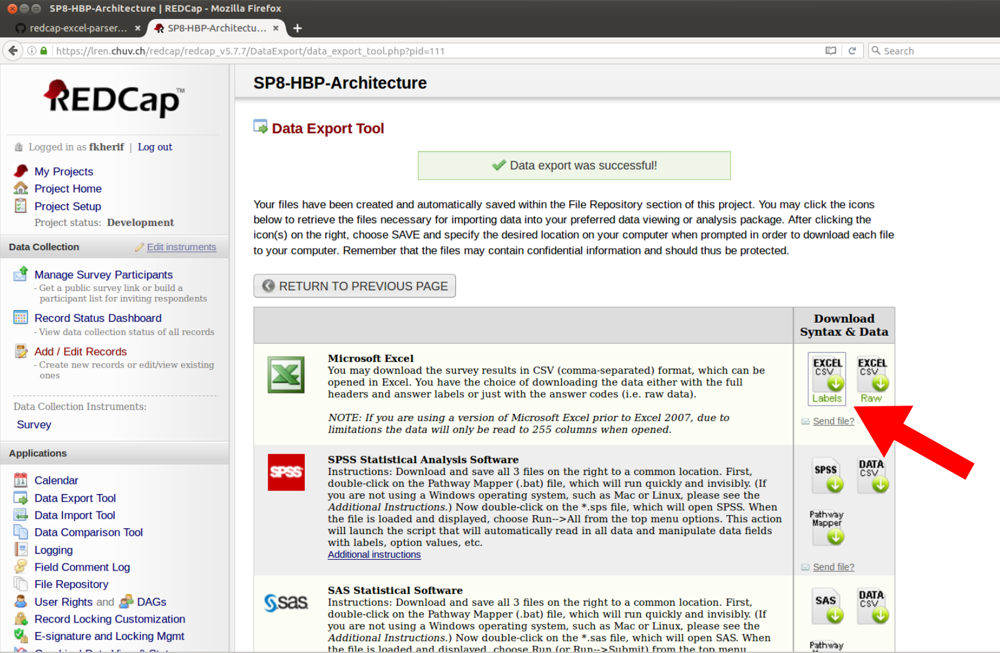

# Redcap data parser

[](https://travis-ci.org/LREN-CHUV/hbp-parser)


[RedCap](https://lren.chuv.ch/redcap/) is a secure, web-based application for building and managing online surveys and databases.
It contains descriptions software, data and web packages being developped by the Human Brain Project (HBP). All the information stored in the redcap database can be extracted to a **csv** file. 

* **This program** takes as input the 'csv' file exported from redcap and saves this information in a structured human redable Microsoft Word document.
* Currently tested on Ubuntu 16.04

# Installation

1. Dependencies

* [python-docx](https://python-docx.readthedocs.io/en/latest/)
* [openpyxl](https://openpyxl.readthedocs.io/en/default/)

2. Download or clone the repository.

```
$ git clone https://github.com/LREN-CHUV/redcap-data-parser.git
```

3. cd to ../redcap-data-parser/ and run the following command:

```
$ sudo python setup.py install
```
If successful the redcap-parser will be installed. 


# Quick usage

1. Login to the [RedCap](https://lren.chuv.ch/redcap/)  website and navigate to your project and go to export data. 



2. Click on the icon shown in the figure above (first row and column entry in **Download Syntax & Data**) which 
   will prompt you to save a .csv file.

3. Navigate in your terminal to the csv file and run the following command:

```
$ rcparse.py data.csv 
```
It should create, where you executed the command, a time stamped microsoft word document.


